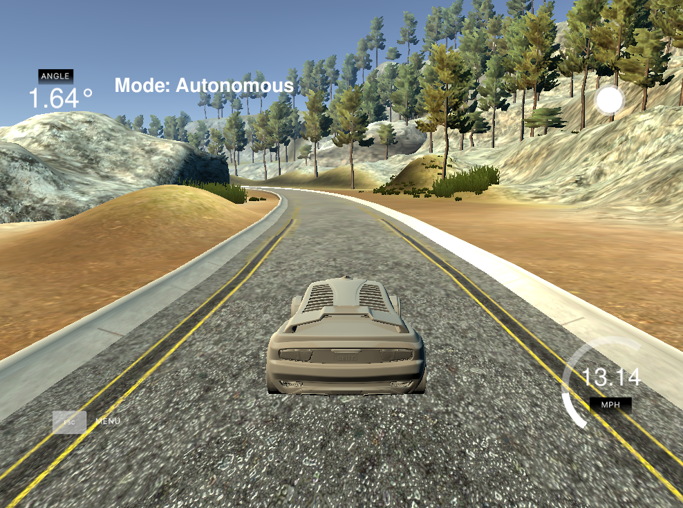
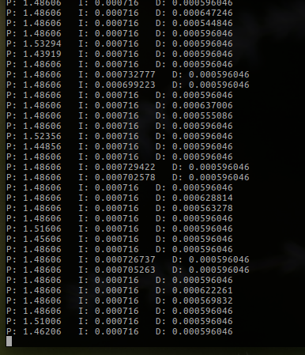

# PID Controller Project

This is the PID controller project for Udacity's self-driving car
program.  The original repo can be found 
[here](https://github.com/udacity/CarND-PID-Control-Project). To 
be at all useful, it depends on the Udacity simulator, available 
[here](https://github.com/udacity/CarND-PID-Control-Project/releases).  



The code as it exists in this repository simply runs the PID
controller so that the car runs on the track.  To run the 
tuning mechanism, simply change the `TUNE_CONTROLLER` to `true` in 
`main.cpp`.


### General Ideas

Using `autonomous` mode with the simulator gives us access to 
the throttle, steering and cross-track error.  The primary goal
of the project is to steer the car around the track using the 
cross-track error and a PID controller.  That is, the steering 
will be determined by the lateral distance from the center
of the track using the PID controller.  Since we do not know
the dynamics of the car, we will need to tune the controller.  Upon doing
so the car should be able to stay on the road adequately.  The
idea, of course, is that a car should be able to be controlled
based on a path, and in this case the path is simply the center of
the road.  It is critical to be able to control the car, as in
real-life situations with a computed path the car needs to behave
as expected.  Secondarily, speed regulation is an objective of 
the project.  This is simply applying a second PID controller
to control the speed in the context of a non-zero control value.


### How To Build

You will need to install some dependencies, as noted in the README 
and included in the stock project.  You may need to install other dependencies 
depending on your setup.  After that, create a `/build`, run `cmake ..` 
and `make` the project.  Then run the `pid` executable 
and it will connect with the simulator when the simulator is in 
`autonomous` mode.


### Code Overview

The way I implemented the controller is pretty standard (I would
think).  It is a class with a constructor that takes the 
coefficients, and an `Update` method that takes the next error
term, updates some internal variables and returns the 
evaluated result.  In my case the internal variables are `public`
because a supportive tuning class can then have access to mutate
them.

Tuning is performed by instantiating the `Tune` class with the 
starting values for the deltas.  After a given number of updates
in the main driving loop, the `Update` method is called with a
reference to the PID object as an argument.  This allows the 
`Tune` class to mutate the controller coefficients and reset
properties like the total squared cross-track error.  The `Tune`
class itself maintains knowledge of its own state in tuning the
PID controller.  

The implementation of the tuning is subtly different than the
way the lessons were designed.  The reason for this is there is
an inversion of control in the execution of test runs. In the 
example lessons we could call the test run from within the
optimization routine; using the simulator we execute the 
optimization routine from within the test run.  The most 
expedient way of solving this appeared to be a class with tracked
internal state.  You will note there are state transitions
defined so that the state and state transition are preserved
when performing operations outside the scope of the instance.


### How Tuning Works

In this project the tuning works by refining estimates of the proportional,
integral and derivative coefficients while monitoring the total squared 
cross-track error.  That is to say, we have a starting guess for the
coefficients, a starting collection of deltas for how much to change them,
and as we continue driving the car, we constantly update the coefficients
to reduce the total squared cross-track error.  We have to set a number
of evaluation points that we will use for computing the total squared
cross-track error for each run, and we have to set sane values for the 
initial controller coefficients and the deltas.  

To make the tuning runs more comparable, tuning is not used at the 
very beginning of the course while the speed of the car is not 
stable.  Once the car reaches a stable speed, tuning is enabled.  The
method cycles over the coefficients, and for each coefficient computes
a baseline total squared cross-track error.  If, after increasing the 
coefficient, the total squared cross-track error is reduced, this new value
is used and the delta value is increased.  If the value is not improved,
a value for the coefficient that is lower is tried.  If this is an 
improvement in the performance, this value is retained and the delta is 
increased.  If none of these cases are met, the value remains the same 
and the delta is decreased.  At this point the next coefficient has this
process performed.  In my implementation there is no end to these cycles;
you simply observe convergence as the runs occur.  Then you can use
this values to instantiate the static PID controller to run the whole
track.

The tuning process is an optimization problem; it is 
attempting to minimize the total squared cross-track error.  This can 
be a daunting problem, as there is no reason to believe that there are 
not local minima.  That said, it is important to start near a reasonable
collection of coefficient values, as the tuning process is then
more likely to determine the best solution.


### Results

Tuning the controller is actually more difficult than one
might expect. There are two ways that the tuning can occur.  First,
the car can be reset each time a tuning run is made.  Second, 
the tuning can occur continuously as the car drives.  There are
arguments to be made for both, but what I ultimately settled on
was the first.  The reason for this is that while it is less
flexible in determining dynamic coefficients, it is more 
repeatable.  Using the tuning technique in this project, 
repeatability is very important, as it makes the total squared
cross-track error more comparable.

What I found most helpful is to be able to choose a reasonable 
proportional-only controller that will not veer off the road as a 
starting point.  This way the delta starting point can be set relatively
small so that as it changes we do not encounter an operating point
where the car looses control as easily.  If the car looses control, 
the total squared cross-track error is generally high, and the tuning
starts increasing the deltas to find the best new estimate.  In 
practice this seems to have the effect of making things worse.  This
is because in the circumstance with the car in the simulators, even
rather small coefficients for the derivative and integral terms 
have fairly large effects on the steering.  This is why the `Tune`
class takes the starting deltas as arguments, as this allows us to
having finer control of the changes in the derivative and integral
term than the proportional term if needed.

It proves to be fairly simple to derive reasonable results at low
speed, but the faster the car is moving the harder the problem.  In
part because of the dynamics of the car, in part because the tuning
is made harder because the car either travels farther in a tuning 
step (and has more likelihood of getting off the track), or because
the tuning steps are fewer and the estimation for the optimization
problem is worse.  That said, there is a lot of opportunity for 
spending significant amounts of time trying to tune the performance 
at higher speed that may not be the best use of time.

[Here](https://youtu.be/f0BUGRaUlqM) is a video of the car driving around the track the way
that I implemented the project.  As you can see, it isn't great 
but it stays on the track.  The PID coefficients were determined
using the tuning mechanism described above starting with a wild guess
guess for a proportional-only coefficient.  This was enough, I 
figured, to keep it on the straight stretch at the beginning of the
track.



Above is a log of training the PID controller.  You can't really 
tell given the length of the log, but it started from a 
proportional-only constant of `0.1`!  The integral and 
derivative components end up being very small.  You will note in
playing with the controller that an integral component in 
excess of about `0.005` will make for wild oscillations
in the car trajectory.  The derivative is more of an issue
in the corners in helping to compensate for the increased
angle with respect to steering.  Since the training I performed
was on the straight stretch, the derivative component is potentially
a bit low.  However, training on the curves tends to get 
the car out of the lane much more easily.  Of course
there could be multi-stage training where the car is first
trained on the straight stretch and then trained on the
curves with smaller deltas and starting with the values that 
it attained from the straight stretch.  As you can see, using 
the type of optimization run that I was using, the delta values
that I was using, and the starting value for the proportinality
coefficient that I was using, we end up with the following 
approximate values for the coefficients:

```
Kp: 1.5
Ki: 0.0007
Kd: 0.0006
```

Interestingly, and as you can see in the video, the performance
on the curves is pretty jerky with these values.  When it was tuned
using a proportional delta of `0.1` and converged to a proportional
value of `0.225`, it was far more stable on the turns, but wavered on
the road more in general.  I suspect one problem with training
based on the total squared cross-track as a metric is that oscillatory
motion has as little total error as smoothly tracking, but far from
center, error.  In any event, while the car oscillates, it does stay
on the track reliably, and in the straight stretches, more indicative
of where it was tuned, it performs quite well.


### Areas For Improvement

There are a number of areas that could be improved, mainly having
to do with tuning and optimal coefficient generation.  A randomization
of the coefficients could be used to help search over a larger 
space so that we do not get stuck in a local minima in terms of the 
total squared cross-track error.  This is actually a very real
problem.  When I first set out to optimize the coefficients, I used 
a starting proportional delta of `0.1`.  This converged to a proportional
coefficient of about `0.225`.  However, if the starting proportional
delta is set to `0.3`, the controller converges to a proportional
coefficient of about `1.6`, and qualitatively looks better while 
driving.  The car speed could be incrementally increased as 
we find stable solutions so that the coefficients track as the speed
increases rather than having to get it right the first time at higher
speed. Multiple optimizations could be implemented sequentially to get
better performance.  All in all there are a *lot* of ways that the 
performance can be improved.


### Et Cetera

I did actually have a maximum cross-track error detection implemented at one 
time.  The reason for this was because I was allowing the tuning to occur
without resetting the car on the track, as this allows more dynamic 
tuning of the PID controller.  The rationale for this is that in a turn,
say, you may want subtly different parameters than on a straight 
stretch.  Allowing the PID tuning to be dynamic would facilitate this.  However,
the repeatability is not present, and consequently the use of the total squared
cross-track error is not a good metric.  Since the straight stretch at the 
beginning of the track is now used for training the controller, and the
problem is started with a sane value for the proportional component, 
it isn't all that necassary to test for being off the track.  Essentially,
all you do is put a test against the magnitude of the cross-track error in
the loop and reset the car position if it exceeds a threshold.  In the case of 
this track, the threshold is roughly `1.5`.

